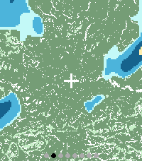

# Rain Radar for Pebble

A rain radar app for the **Pebble Time 2 (Emery)** smartwatch. It displays a live rain radar overlay on top of an OpenStreetMap base map, centred on your location.



## Features

- **Live rain radar** from [RainViewer](https://www.rainviewer.com/) overlaid on OpenStreetMap tiles
- **Multiple time steps** — stores up to 5 recent radar frames, within a strict memory budget
- **Dry-area notice** — displays “No rain in your area” when every loaded overlay is clear
- **Loading feedback** — displays “Getting radar data…” while overlays are arriving
- **Animated radar history** — advances every second, pauses on the latest frame for 3 seconds, and resumes 3 seconds after manual navigation
- **Frame navigation** — use the Up/Down buttons to step through recent radar frames
- **Two crop modes** — Wide (zoom  out) and Standard (zoomed in), toggled with Select
- **Frame position indicator** — ordered oldest-to-newest from left to right
- **Frame age** — shows the selected radar image's age in minutes

## Target Hardware

- **Platform:** Pebble Time 2 (`emery`)
- **Display:** 200×228 colour (64-colour palette)

## How It Works

The app is split between the phone (PebbleKit JS) and a native Pebble C watch app.

### Phone Side

1. Fetches the user's GPS location (falls back to a hardcoded default)
2. Downloads OpenStreetMap raster tiles and assembles a base map centred on the location
3. Fetches the latest radar timestamps from the RainViewer API (up to 5 candidates)
4. Renders the background map once — remaps colours to the Pebble 64-colour palette, applies a wash for readability, draws a centre crosshair, and PackBits RLE-encodes the result
5. For each radar time step, fetches the radar tile, classifies rain intensity into a compact 6-level palette, and PackBits RLE-encodes the overlay
6. Sends the background as chunked messages, then sends each radar frame as chunked messages, followed by a batch-done signal

### Watch Side

1. Reserves one bounded 72 KB arena and advertises its actual capacity to the phone
2. Receives the background and as many newest radar frames as fit into that arena
3. On batch completion, composites the display: decodes the background RLE stream, then overlays the current radar frame using the rain palette
4. Animates from the oldest stored frame to the newest; Up/Down navigation temporarily pauses the animation

### Memory model

The watch never keeps a raw 200×228 image for each time step. It retains the
compressed background and radar overlays, then decodes the selected pair
directly into the display only when it needs to draw.

PackBits uses literal blocks as well as repeated runs. A frame containing
45,600 pixels therefore has a provable maximum encoded size of 45,957 bytes;
the earlier pair-only RLE could grow to 91,200 bytes on rapidly changing
colours. At startup, the native watch app reserves a single RLE arena capped at
72,000 bytes. Allocation backs off safely if that full amount is unavailable.
It advertises the resulting capacity to the phone, which sends the newest
frames that fit. If capacity is reached anyway, the watch keeps the newest
accepted frames and simply stops accepting older history.

Retained RLE data uses non-owning views within that arena, avoiding allocator
fragmentation between refreshes. Decoding draws runs directly into the screen
graphics context, so there is no retained raw framebuffer and no Alloy/XS heap.

### Rain Intensity Palette

| Level    | Colour on watch |
|----------|----------------|
| Drizzle  | Light cyan     |
| Light    | Blue           |
| Moderate | Dark blue      |
| Heavy    | Yellow         |
| Intense  | Orange         |
| Extreme  | Dark red       |

## Building and testing

The Pebble SDK and CLI must be installed inside WSL. From Windows PowerShell:

```powershell
npm test
npm run build:watch
# Force a clean Pebble build when needed:
powershell -ExecutionPolicy Bypass -File scripts/build-watch.ps1 -Clean
```

The build script converts the Windows checkout path to its WSL mount, verifies
that `pebble` is available inside WSL, and runs the build there. The deployable
bundle is written to `build/rain-radar.pbw`.

From a WSL shell, the equivalent commands are:

```bash
cd /mnt/d/Personal/pebble/rain-radar
pebble build
pebble install --emulator emery --logs
```

## Project Structure

```
src/
  c/           — Native watch app, bounded RLE arena and compositing decoder
  pkjs/        — Phone-side PebbleKit JS (fetch, render, send pipeline)
scripts/       — Debug/render helpers
```

## Data Sources

- **Base map:** [OpenStreetMap](https://www.openstreetmap.org/) raster tiles
- **Radar:** [RainViewer API](https://www.rainviewer.com/api.html) (free public weather radar)
